# DevOps Documentation - Native

Hello, Please go through the below steps in order to setup MCI native architecture using AWS EC2 instances. 

---
## Create VM (AWS EC2 Instance) for MongoDB, frontend & backend

This step is common for creating frontend, backend & mongodb instance. Following steps will help you setup AWS ec2 instance for configuring required VMs. Please create three instances by following below steps.


### 1. Go the the EC2 service

Open the Amazon EC2 console at https://console.aws.amazon.com/ec2/ & Choose Launch Instance.


### 2. Choose an AMI

Select the ami for setting up the instance. For development, we have used ami type ubuntu 20.04 (x86_64). 


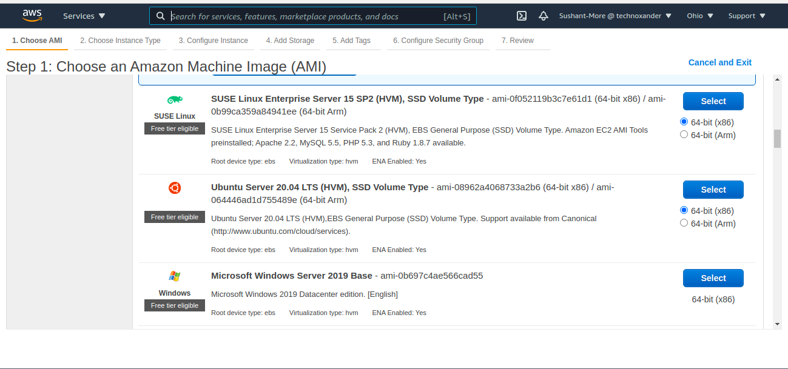

Select AMI type & click on next.

### 2. Select an instance type

Select the instance type for each layer. For development we have used t2.small for frontend & mongoDB & t2.medium for backend. For production please check following recommendations.

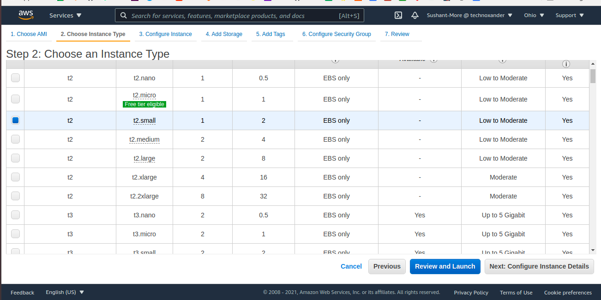

Select instance type & press on **Review & Lanunch**.

### Add tags

Add tags if required as shown in the image and press **Next: Configure Security Group**

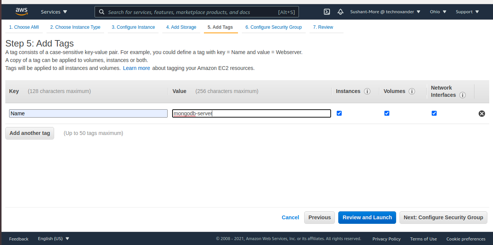


### Configure Security groups

Now it's time to configure firewall for securing our VMs. You can either configure new security group or select existing one. Please check section **Firewall Rules** to understand more about firewall ports.

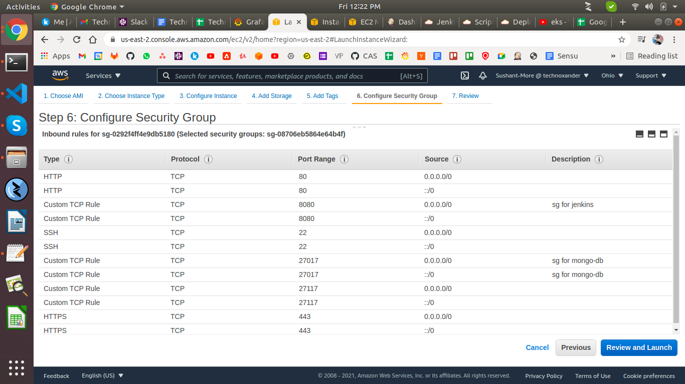
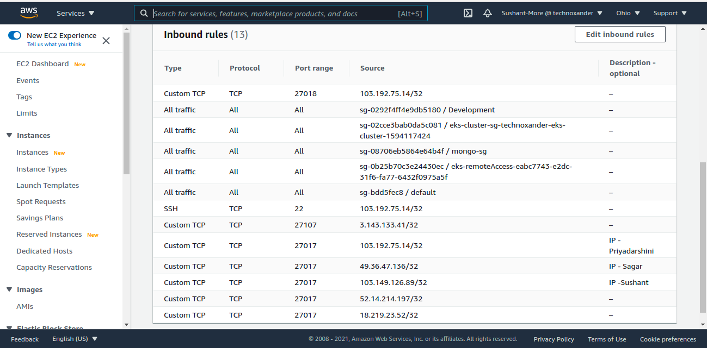


### Firewall Rules

**Inbound : All ports except allowed ones are restricted by Default**


**Outbound : All ports are allowed by Default**
#### Allow Frontend inbound rules

 - Select type : HTTP (port 80) and add source : 0.0.0.0
 - Select type : HTTPS (port 443) and add source : 0.0.0.0
 - Select type : SSH (port 22) and add source : 0.0.0.0

#### Allow Backend inbound rules

 - Select type : Custom TCP (port 8080, for Jenkins) and add source : 0.0.0.0
 - Select type : HTTPS (port 443) and add source : 0.0.0.0
 - Select type : SSH (port 22) and add source : 0.0.0.0

#### Allow MongoDB inbound rules

 - Select type : Custom TCP (port 27017, for MongoDB) and add source : 0.0.0.0
 - Select type : SSH (port 22) and add source : 0.0.0.0


### Select an ssh Keypair

Select SSH keypair in order to login to your instance. You can either choose existing keypair or create new keypair.

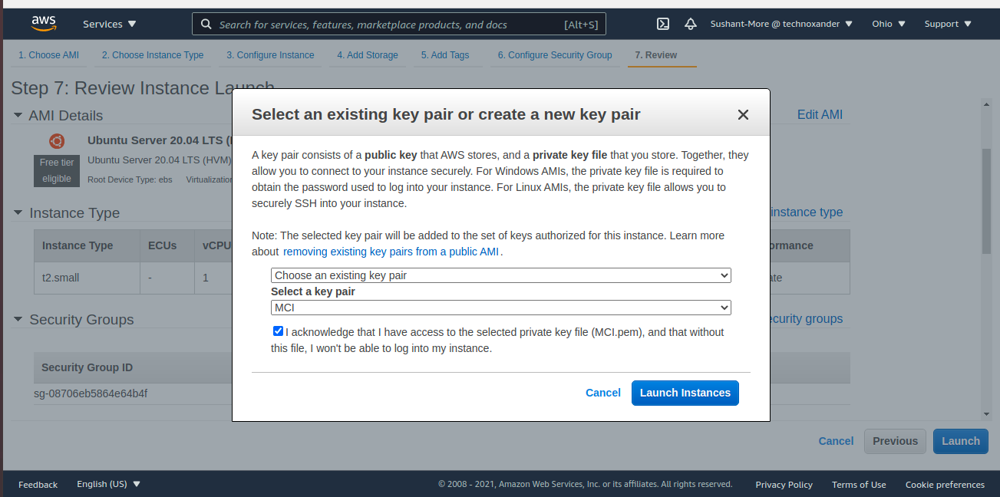

---
## MongoDB setup

## What it is
MongoDB is a source-available cross-platform document-oriented database program. Classified as a NoSQL database program, MongoDB uses JSON-like documents with optional schemas.

## Prerequisites 
 - RAM : 8 GB
 - Storage : 200 GB
 - Operating system : Linux/Windows

## What we used ( for development) : 
- Virtual Machine : 2 vCPU, 4 GB RAM 
- Operating System : Ubuntu 20.4
- Databases created : dev , uat
- Remote database users created : dev, uat, admin
- Database port : 27017 (default)


## Mongo DB on Linux
[MongoDB installation guide](https://docs.mongodb.com/manual/installation/)
 1. Import the public key used by the package management system.


        wget -qO - https://www.mongodb.org/static/pgp/server-4.4.asc | sudo apt-key add -

 2. Create a list file for MongoDB.

        echo "deb [ arch=amd64,arm64 ] https://repo.mongodb.org/apt/ubuntu focal/mongodb-org/4.4 multiverse" | sudo tee /etc/apt/sources.list.d/mongodb-org-4.4.list

 3. Reload local package database.

        sudo apt-get update

 4. Install the MongoDB packages.

        sudo apt-get install -y mongodb-org

 5. Start MongoDB

        sudo systemctl start mongod 


## Create Databases

 - Create 'dev' database

       > use dev
       switched to dev
       > db
       dev
       > db.inventory.insertOne(
           { item: "canvas", qty: 100, tags: ["cotton"],
           size: { h: 28, w: 35.5, uom: "cm" } }
         )
       > show databases
       admin 0.000GB
       dev 0.000GB
       local  0.000GB

 - Create 'uat' database

       > use uat
       switched to uat
       > db
       uat
       > db.inventory.insertOne(
         { item: "canvas", qty: 100, tags: ["cotton"],
         size: { h: 28, w: 35.5, uom: "cm" } }
       )
       > show databases
       admin 0.000GB
       dev 0.000GB
       uat 0.000GB
       local  0.000GB

## Add remote users to MongoDB

 - Add an admin user


        > use admin;
        > db.createUser({
                user: "admin",
                pwd: "myadminpassword",
                roles: [
                            { role: "userAdminAnyDatabase", db: "admin" },
                            { role: "readWriteAnyDatabase", db: "admin" },
                            { role: "dbAdminAnyDatabase",   db: "admin" }
                        ]
            });

 - Add a dev user

        > db.createUser({
                user: "technox-admin",
                pwd: "tEcHnOx#431",
                roles: [
                            { role: "dbOwner", db: "dev" }
                       ]
            });

 - Add an uat user

        > db.createUser({
                user: "technox-admin",
                pwd: "tEcHnOx#431",
                roles: [
                            { role: "dbOwner", db: "uat" }
                       ]
            });

[Click here](https://docs.mongodb.com/manual/tutorial/install-mongodb-on-windows/) for MongoDB Windows setup.  


  [MongoDB disk and memory requirements](https://learn.fotoware.com/On-Premises/FotoWeb/05_Configuring_sites/Setting_the_MongoDB_instance_that_FotoWeb_uses/MongoDB_disk_and_memory_requirements#:~:text=MongoDB%20requires%20approximately%201GB%20of,performance%2C%20and%20should%20be%20avoided.)

  - Disk
  
    Each asset remains approximately 10 days in MongoDB after deletion. Hence, the approximate formula for calculating the number of assets can be expressed as follows:


        **N = i * (t + 10) + p**

        p: Number of assets that are permanently in the system
        t: Max number of days an asset is kept in the system after ingestion
        i: Number of assets ingested per day (24h)
        N: Total number of assets in the system at any given time.

        
        Each asset requires approximately 10Kb of space. The formula to calculate the disk space required for assets in MongoDB goes like this:

        Disk space (Megabytes) = N * 0,01

- Memory

    MongoDB requires approximately 1GB of RAM per 100.000 assets. If the system has to start swapping memory to disk, this will have a severely negative impact on performance, and should be avoided.


[Performance Best Practices: Hardware and OS Configuration](https://www.mongodb.com/blog/post/performance-best-practices-hardware-and-os-configuration) : 
  - Run on Supported Platforms
  - Ensure Your Working Set Fits in RAM
  - Use Multiple CPU Cores
  - For best performance, you should run one mongod process per host.
  - Configuring the WiredTiger Cache
  - Use Multiple Query Routers
  - Use Interleave Policy on NUMA Architecture
  - Network Compression
  - Use SSDs for IO Intensive Applications
  - Use MongoDB’s Default Compression for Storage and I/O-Intensive Workloads
  
---
## SCM (Source Code Management) Setup

### What it is :
- Git is a de-facto standard for distributed version control systems and is used by the majority of developers nowadays. 
- It allows you to keep track of your code changes, revert to previous stages, create branches, and to collaborate with your fellow developers.

**NOTE:** We have used GiHub in our case, other options available are GiLab, CVS, Mercurial & bitbucket.

### Prerequisities :

You should have git installed on your machine in order to perform operations on your remote repository.

#### Git Installation
- Start by updating the package index:
       
       sudo apt update
- Run the following command to install Git:
       
       sudo apt install git
- Verify the installation by typing the following command which will print the Git version:

       git --version

#### Configuring Git

Now that you have git installed, it is a good idea to set up your personal information that will be used when you commit your code.
- To set your git commit username and email address:

       git config --global user.name "Your Name"
       git config --global user.email "youremail@yourdomain.com"
- To verify the configuration changes

       git config --list
- The configuration settings are stored in the ~/.gitconfig file:

### How to use ssh keys in github
#### Why Use an SSH Key?
- When working with a GitHub repository, you'll often need to identify yourself to GitHub using your username and password. An SSH key is an alternate way to identify yourself that doesn't require you to enter you username and password every time.

- SSH keys come in pairs, a public key that gets shared with services like GitHub, and a private key that is stored only on your computer. If the keys match, you're granted access.

#### Generating an SSH key pair :
- The first step in using SSH authorization with GitHub is to generate your own key pair.

- You might already have an SSH key pair on your machine. You can check to see if one exists by moving to your .ssh directory and listing the contents

       cd ~/.ssh
       ls

- If you see id_rsa.pub, you already have a key pair and don't need to create a new one.

- If you don't see id_rsa.pub, use the following command to generate a new key pair. Make sure to replace your@email.com with your own email address

       ssh-keygen -o -t rsa -C "your@email.com"
- When asked where to save the new key, hit enter to accept the default location

       enerating public/private rsa key pair.
       Enter file in which to save the key (/Users/username/.ssh/id_rsa):
- You will then be asked to provide an optional passphrase. This can be used to make your key even more secure, but for this lesson you can skip it by hitting enter twice. 

       Enter passphrase (empty for no passphrase):
       Enter same passphrase again:
- When the key generation is complete, you should see the following confirmation:

       Your identification has been saved in /Users/username/.ssh/id_rsa.
       Your public key has been saved in /Users/username/.ssh/id_rsa.pub.
       The key fingerprint is:
          01:0f:f4:3b:ca:85:d6:17:a1:7d:f0:68:9d:f0:a2:db your@email.com
          The key's randomart image is:
          +--[ RSA 2048]----+
          |                 |
          |                 |
          |        . E +    |
          |       . o = .   |
          |      . S =   o  |
          |       o.O . o   |
          |       o .+ .    |
          |      . o+..     |
          |       .+=o      |
          +-----------------+
- Add your public key to GitHub
    - Now need to tell GitHub about your public key. Display the contents of your new public key file with cat:

          cat ~/.ssh/id_rsa.pub

    - Copy the contents of the output to your clipboard.

    - Login to github.com and bring up your account settings by clicking the tools icon.

    - Select SSH Keys from the side menu, then click the Add SSH key button.

    - Name your key something whatever you like, and paste the contents of your clipboard into the Key text box.

    - Finally, hit Add key to save. Enter your github password if prompted.


## Docker 

### What it is

Docker is an open platform for developing, shipping, and running applications. Docker enables you to separate your applications from your infrastructure so you can deliver software quickly. With Docker, you can manage your infrastructure in the same ways you manage your applications. By taking advantage of Docker’s methodologies for shipping, testing, and deploying code quickly, you can significantly reduce the delay between writing code and running it in production.

### Docker Installation

To get started with Docker Engine on Ubuntu, make sure you meet the prerequisites, then install Docker.

### Prerequisites

#### OS requirements 
To install Docker Engine, you need the 64-bit version of one of these Ubuntu versions:
- Ubuntu Focal 20.04 (LTS)
- Ubuntu Bionic 18.04 (LTS)
- Ubuntu Xenial 16.04 (LTS)
​
Docker Engine is supported on x86_64 (or amd64), armhf, and arm64 architectures.


### Uninstall old versions
Older versions of Docker were called docker, docker.io, or docker-engine. If these are installed, uninstall them:
​

    sudo apt-get remove docker docker-engine docker.io containerd runc

### Installation methods
You can install Docker Engine in different ways, depending on your needs:
​
- Most users set up Docker’s repositories [ set up Docker’s repositories ](https://docs.docker.com/engine/install/ubuntu/#install-using-the-repository )and install from them, for ease of installation and upgrade tasks. This is the recommended approach.
- Some users download the DEB package and  [install it manually ](https://docs.docker.com/engine/install/ubuntu/#install-from-a-package)and manage upgrades completely manually. This is useful in situations such as installing Docker on air-gapped systems with no access to the internet.
- In testing and development environments, some users choose to use automated  [convenience scripts ](https://docs.docker.com/engine/install/ubuntu/#install-using-the-convenience-script)to install Docker.

### Install using the repository
Before you install Docker Engine for the first time on a new host machine, you need to set up the Docker repository. Afterward, you can install and update Docker from the repository.
### Set up the repository
- Update the apt package index and install packages to allow apt to use a repository over HTTPS:

    sudo apt-get update
    sudo apt-get install \
       apt-transport-https \
       ca-certificates \
       curl \
       gnupg \
       lsb-release
​      
- Add Docker’s official GPG key:
​

    curl -fsSL https://download.docker.com/linux/ubuntu/gpg | sudo gpg --dearmor -o /usr/share/keyrings/docker-archive-keyring.gpg
​
- Use the following command to set up the stable repository. To add the nightly or test repository, add the word nightly or test (or both) after the word stable in the commands below. [Learn about **nightly** and **test** channels.](https://docs.docker.com/engine/install/)
​

    echo \ "deb [arch=arm64 signed-by=/usr/share/keyrings/docker-archive-keyring.gpg] https://download.docker.com/linux/ubuntu \
     $(lsb_release -cs) stable" | sudo tee /etc/apt/sources.list.d/docker.list > /dev/null

### Install Docker Engine
- Update the apt package index, and install the latest version of Docker Engine and containerd, or go to the next step to install a specific version:

      sudo apt-get update
      sudo apt-get install docker-ce docker-ce-cli containerd.
​
​
- Verify that Docker Engine is installed correctly by running the hello-world image.
​

       sudo docker run hello-world
​
*This command downloads a test image and runs it in a container. When the container runs, it prints an informational message and exits.*
​

Docker Engine is installed and running. The docker group is created but no users are added to it. You need to use sudo to run Docker commands. Continue to [Linux postinstall ](https://docs.docker.com/engine/install/linux-postinstall/)to allow non-privileged users to run Docker commands and for other optional configuration steps.

### Post-installation steps for Linux
This section contains optional procedures for configuring Linux hosts to work better with Docker.
​

[Post-installation steps for Linux ](https://docs.docker.com/engine/install/linux-postinstall/)
## Manage Docker as a non-root user

- Create the docker group.

      sudo groupadd docker
- Add your user to the docker group.
​
      sudo usermod -aG docker $USER      

- Log out and log back in so that your group membership is re-evaluated.


### Install Docker on Windows 
Welcome to Docker Desktop for Windows. This page contains information about Docker Desktop for Windows system requirements, download URL, installation instructions, and automatic updates.
​
[Docker Desktop on Windows ](https://docs.docker.com/docker-for-windows/install/)

---

## CI/CD setup 

### What it is

CI/CD or CICD generally refers to the combined practices of continuous integration and either continuous delivery or continuous deployment. CI/CD bridges the gaps between development and operation activities and teams by enforcing automation in building, testing and deployment of applications. In our case, we are using Jenkins for CI/CD but following are the alternatives.

### Alternatives

|   Platform    |   Service                   |    
|:-------------:| :--------------------------:|
| AWS           | CodePipeline                |  
| GCP           | Cloud Build                 |   
| GitLab        | Gitlab CI/CD                |
| GitHub        | Github Actions              |   


### What is Jenkins

Jenkins is a free and open source automation server. It helps automate the parts of software development related to building, testing, and deploying, facilitating continuous integration and continuous delivery.

### Prerequisites

 - [Jenkins Hardware Recommendations](https://www.jenkins.io/doc/book/scaling/hardware-recommendations/) 
 - 4 GB+ of RAM
 - 50 GB+ of drive space
 - Java Runtime Environment

### What we used (For development)

 - Virtual Machine : 2 vCPUs, 4 GB RAM
 - Platform : Jenkins
 - Method : [Pipeline](https://www.jenkins.io/doc/tutorials/#pipeline/) 
 - Users created : admin, dev
 - Plugins : Suggested plugins, Role-based Authorization Strategy

### Our Recommendation For Jenkins Server (Production)
 - RAM : 4+ GB
 - Storage : 50 GB
 - Operating System : Linux 


### Jenkins Installation (Linux)

We are installing jenkins on same instance of backend but you can have seperate instance as well. Please check [this link](https://www.linuxtechi.com/install-configure-jenkins-ubuntu-20-04/) to setup Jenkins on ubuntu 20.04

1. Install Java with apt command


       sudo apt install openjdk-11-jre-headless

2. Import the GPG keys of the Jenkins repository using the following wget command:


       wget -q -O - https://pkg.jenkins.io/debian/jenkins.io.key | sudo apt-key add -

3. Next, add the Jenkins repository to the system with:

       sudo sh -c 'echo deb http://pkg.jenkins.io/debian-stable binary/ > /etc/apt/sources.list.d/jenkins.list'

4. Once the Jenkins repository is enabled, update the apt package list and install the latest version of Jenkins by typing:

       sudo apt update

5. Install Jenkins

       sudo apt install jenkins

[Click here](https://www.jenkins.io/doc/book/installing/windows/) for setting up Jenkins on Windows

## Unlock Jenkins

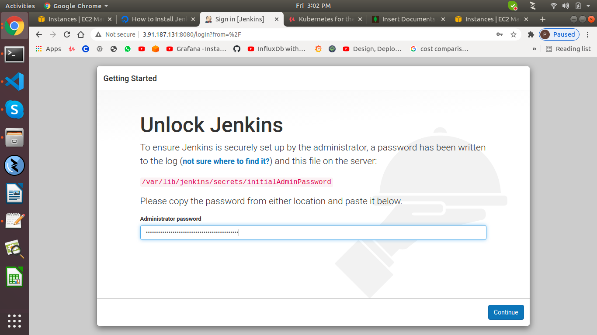

## Install suggested plugins

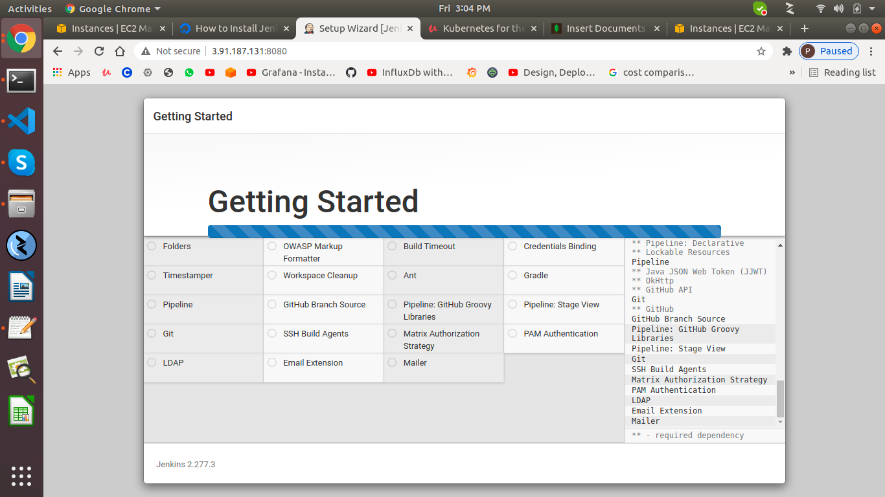

## Create an admin user 

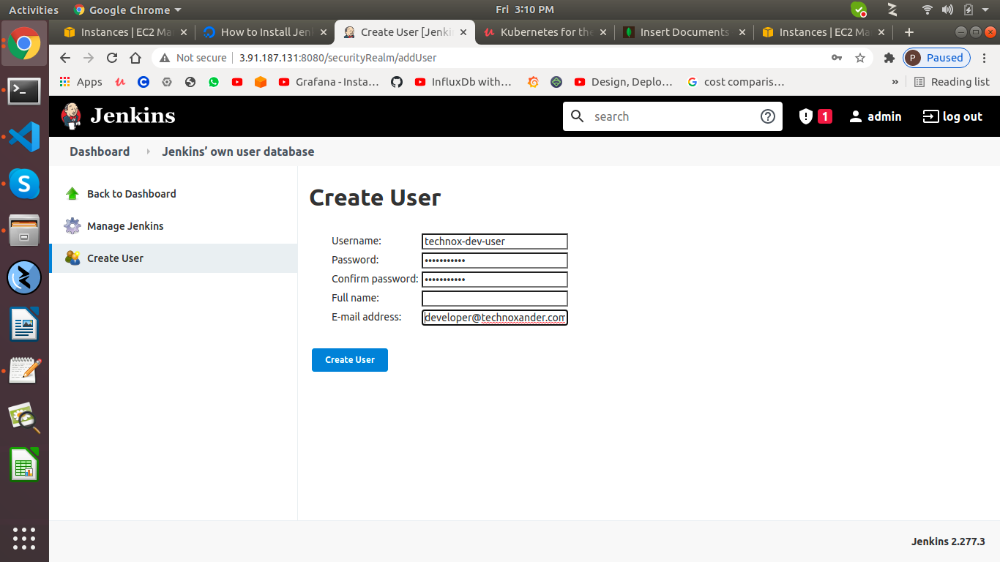

## Create a developer role

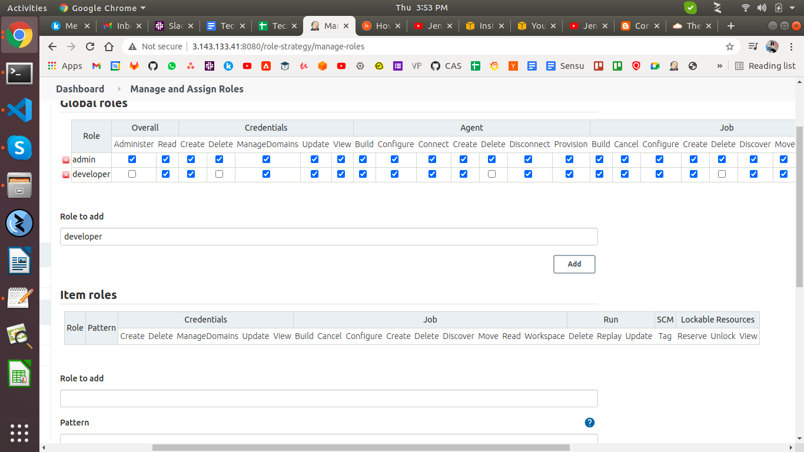

## Add Github credentials for cloning

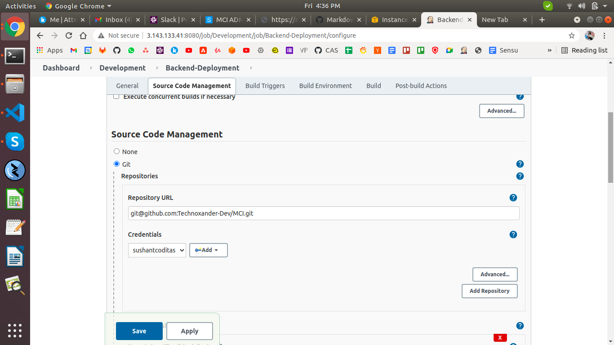


## Add Global security credentials (ssh keys)

1. Let's create a new domain, called Web Servers. We can then add authorization credentials to that domain. To create the new domain, log in to your Jenkins instance and click Credentials in the left navigation

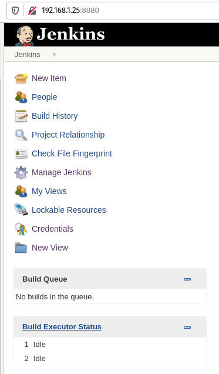

2. You should see a new entry appear under Credentials, called System. Click that and you'll then see Add Domain. Click that and a new window will appear. In that new window, type WEB SERVERS as the Domain and type an optional description.

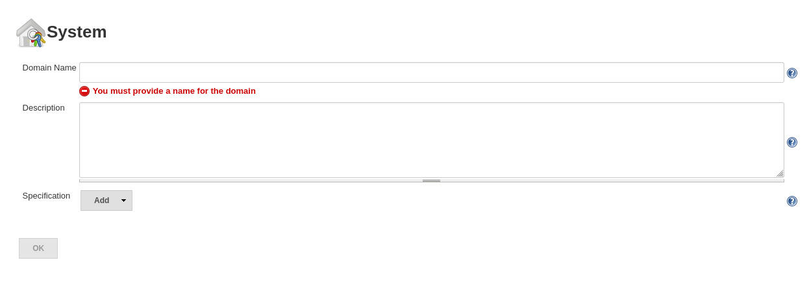

3. Next click the Specification drop-down and select Hostname. In the resulting new text area, click the drop-down to the right of the text area to expand it such that you can add multiple hostnames. In this new area, type all of the IP addresses or domains that will be associated with this domain--one per line

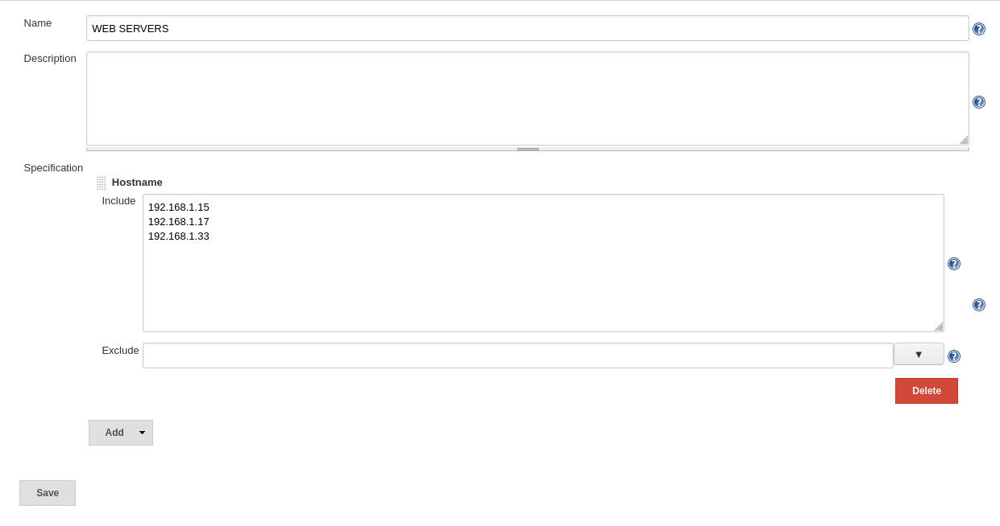


**Note**: Adding hosts to the domain is optional. You might want to use this if you are creating a domain that will be used only for specific remote machines.

4. Once you've typed the addresses click the Save button and the new domain is ready. In the resulting window, click Add Credentials in the left navigation. You will then be required to fill out the necessary information for the new credentials

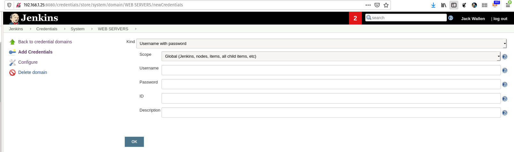

5. If this is to be an SSH username with private key, select that from the Kind drop-down. When adding SSH private key credentials, you must copy and paste the necessary id_rsa.pub key for the user into the new credential. But first type a username for the credential and then click Enter directly and then click Add. In the resulting window, paste the SSH key.

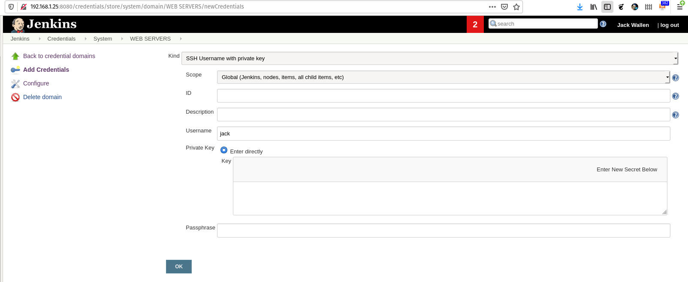

Finally, type the passphrase for the key and click OK.

Your new authorization credential has been successfully added. Since these credentials are stored as encrypted objects, you don't have to worry about using plain text secrets in your code, as you can call those credentials with the help of the Jenkins Credential plugin.

You can find out how to use those credentials with the help of the Pipeline Syntax tool, which can be found at http://SERVER_IP:8080/pipeline-syntax/ (Where SERVER_IP is the address of your Jenkins server.


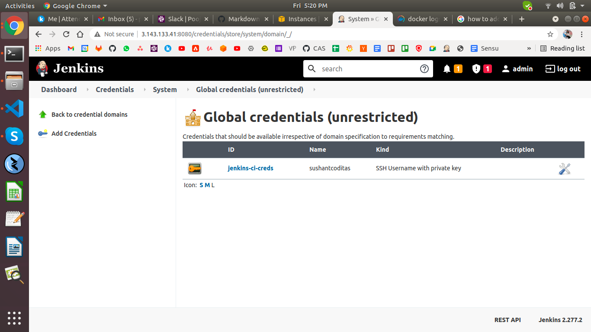


--- 

## Jenkins job type we used : Freestyle Job

## Steps to create a freestyle job

1. Create New Item

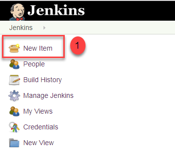

2. Enter Item details
 - Enter the name of the item you want to create. 
 - Select Freestyle project
 - Click Okay

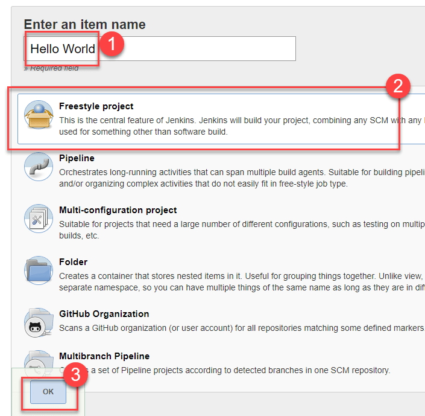

3. Enter Project details (description)
4. Enter repository URL

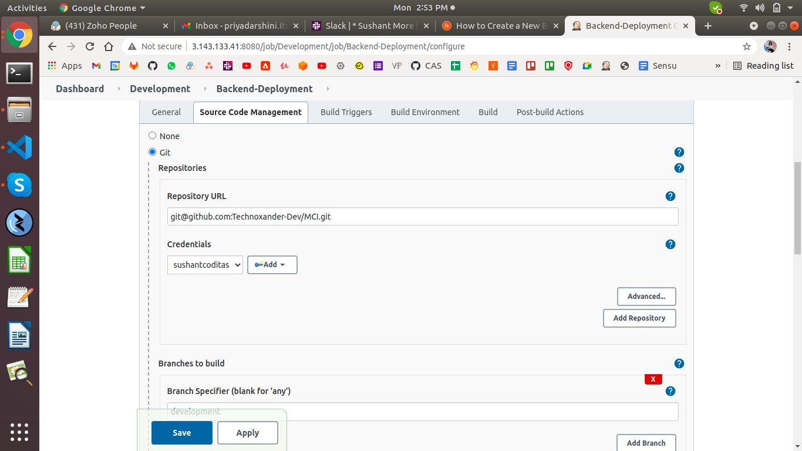

5. Tweak the settings : 
- Now that you have provided all the details, it's time to build the code. Tweak the settings under the build section to build the code at the time you want. You can even schedule the build to happen periodically, at set times.
- Click on "Add build step"

6. Enter the commands you want the job to execute

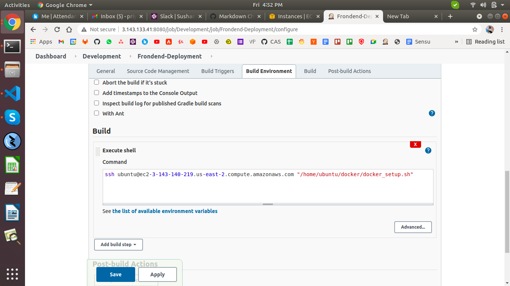


7. Save the project
8. Build Source code


   Now, in the main screen, Click the Build Now button on the left-hand side to build the source code.

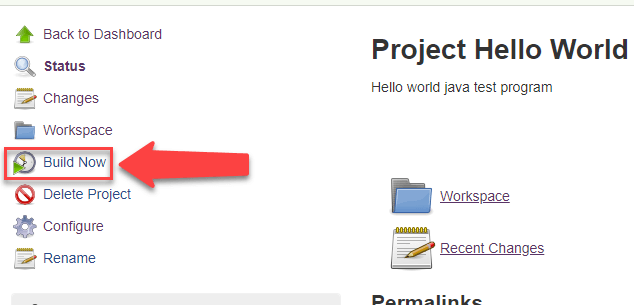


9. Check the status
10. See the console output


## Setup Frontend Deployment Job

We are using the freestyle job to setup & run our docker instances on frontend. Please create freestyle job & copy paste following script in execute shell section. Our Jenkinns Job performs following steps.

1. Login to front end using ssh 
2. Build docker image from cloned source code repository.
3. Remove previously built images.
4. Run the Docker image.
5. Wait 15 seconds for logs generation.
6. Batch-retrieve logs present at the time of execution.


```
ssh ubuntu@ec2-3-143-140-219.us-east-2.compute.amazonaws.com << EOF
rm -rf MCI-Admin
git clone --single-branch --branch development git@github.com:Technoxander-Dev/MCI-Admin.git
cd MCI-Admin
docker build -t mci-frontend --build-arg base_url=https://mci-admin-dev.technoxander.com .
docker container rm -f mci-frontend
docker run --name mci-frontend -d -p 3080:3080 mci-frontend 
sleep 15
docker logs mci-frontend

EOF
```

NOTE : Replace `ec2-3-143-140-219.us-east-2.compute.amazonaws.com` with your frontend server IP or DNS. Also please setup [ssh passwordless connection](https://www.linuxbabe.com/linux-server/setup-passwordless-ssh-login) between jenkins & front end server.


--- 
## Setup Backend Deployment Job

We are having Jenkins job & backend setup on same ec2 instance. This job will pretty much same except ssh into remote server. Make sure you store `.env` & `secrets` on the Jenkins server.

1. Build docker image from cloned source code repository.
2. Remove previously built images.
3. Run the Docker image.
4. Wait 15 seconds for logs generation.
5. Batch-retrieve logs present at the time of execution.

```
cp ~/.env .
cp -r ~/secrets .
docker build -t mci-backend --build-arg port=9095 .
docker container rm -f mci-backend
docker run --name mci-backend -d -p 9095:9095 mci-backend 
sleep 15
docker logs mci-backend
```

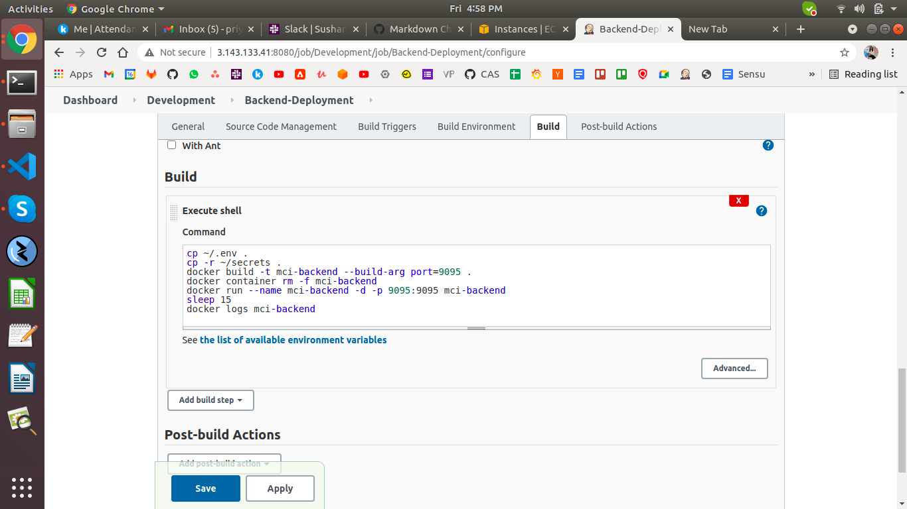


#### Source Code Management

- What we used : GiHub
- Other options Available : GiLab, CVS, Mercurial 


## On premises server requirements 

### Best Practices

[Jenkins Pipeline Best Practices](https://www.jenkins.io/doc/book/pipeline/pipeline-best-practices/)
   - Making sure to use Groovy code in Pipelines as glue
   - Reducing repetition of similar Pipeline steps
   - Avoiding calls to Jenkins.getInstance
   - Avoiding very large shared libraries


## NGINX Proxy Setup

We are using nginx reverse proxy to redirect traffic from system HTTP or HTTPS port to docker port. please go through the following steps to setup nginx.

- Install nginx 

       sudo apt update
       sudo apt install nginx

- Check if nginx is running 

       sudo systemctl status nginx

- To re-enable the service to start up at boot, run following command

       sudo systemctl enable nginx

### Create Required Certificates

Please get the following certificates from required authority & genetate ssl-bundle.crt. Make sure you have private key as well. In our case, we are using comodossl. Please refer [these steps](https://comodosslstore.com/blog/installing-comodo-positivessl-certificate-on-nginx.html) to configure ssl on nginx.

- Create bundler.crt

       cat STAR_technoxander_com.crt SectigoRSAOrganizationValidationSecureServerCA.crt  USERTrustRSAAAACA.crt AAACertificateServices.crt > ssl-bundle.crt

- You are already having privatekey with name `tclssl.key`


### Adding certificate to Nginx

- Add the certificates to both frontend & backend server. 

       sudo nano /etc/ssl/certs/ssl-bundle.crt

and paste he contents of file we generated in above step

- Add the private key to both frontend & backend server

       /etc/ssl/private/domainname.key

and paste the contents of private key

### Frontend Nginx Setup

Please follow the steps given below to setup nginx reverse proxy.

- Login to nginx server

       ssh -i "Key.pem" ubuntu@IP

- Remove the content of default file

       sudo cp /dev/null /etc/nginx/sites-available/default

- Copy Paste Following content to default file

       `sudo nano /etc/nginx/sites-available/default`

paste following content & save the file
```
server {
       listen 80;
       listen [::]:80;
       
       server_name mci-admin-dev.technoxander.com;
       
       access_log /var/log/nginx/reverse-access.log;
       error_log /var/log/nginx/reverse-error.log;

       return 301 https://$host$request_uri;
}

server {
       listen 443;
       server_name mci-admin-dev.technoxander.com;

       access_log /var/log/nginx/reverse-access.log;
       error_log /var/log/nginx/reverse-error.log;

       location / {
           proxy_pass http://localhost:3080;
       }

       ssl on;
       ssl_certificate /etc/ssl/certs/ssl-bundle.crt;
       ssl_certificate_key /etc/ssl/private/domainname.key;
       ssl_prefer_server_ciphers on;
}
```

- Restart nginx

       sudo service nginx restart

### Frontend Nginx Setup

Please follow the steps given below to setup nginx reverse proxy.

- Login to nginx server

       ssh -i "Key.pem" ubuntu@IP

- Remove the content of default file

       sudo cp /dev/null /etc/nginx/sites-available/default

- Copy Paste Following content to default file

```
server {
        listen 80;
        listen [::]:80;

        server_name mci-dev.technoxander.com;
  
        access_log /var/log/nginx/reverse-access.log;
        error_log /var/log/nginx/reverse-error.log;

        return 301 https://$host$request_uri;
}

server {
        listen 443;
        server_name mci-dev.technoxander.com;

        access_log /var/log/nginx/reverse-access.log;
        error_log /var/log/nginx/reverse-error.log;

        ssl on;
        ssl_certificate /etc/ssl/certs/ssl-bundle.crt;
        ssl_certificate_key /etc/ssl/private/domainname.key;
        ssl_prefer_server_ciphers on;

        ssl_client_certificate /home/ubuntu/certs.pem;
        ssl_verify_client optional;
        ssl_stapling on;
        ssl_stapling_verify on;
        # ssl_crl /home/ubuntu/ob_pp_issuingca.crl;
        ssl_verify_depth 2;       

        location ~* ^.+\.(?:css|cur|js|jpe?g|gif|htc|ico|png|otf|ttf|eot|woff|woff2|svg)$ {
          proxy_pass https://www.technoxander.com;
          access_log off;
          expires 7d;
          add_header Cache-Control public;
          ## No need to bleed constant updates. Send the all shebang in one
          ## fell swoop.
          tcp_nodelay off;
          ## Set the OS file cache.
          open_file_cache max=3000 inactive=120s;
          open_file_cache_valid 45s;
          open_file_cache_min_uses 2;
          open_file_cache_errors off;
        }

        location /api/v1/authenticate/tpp {
            if ($ssl_client_verify != SUCCESS) {
              return 403;
            }
            proxy_set_header X-SSL-CERT $ssl_client_cert;
            proxy_pass http://localhost:9095/api/v1/authenticate/tpp;
        }

        location / {
            proxy_pass http://localhost:9095;
        }

}
```

- Restart nginx

       sudo service nginx restart